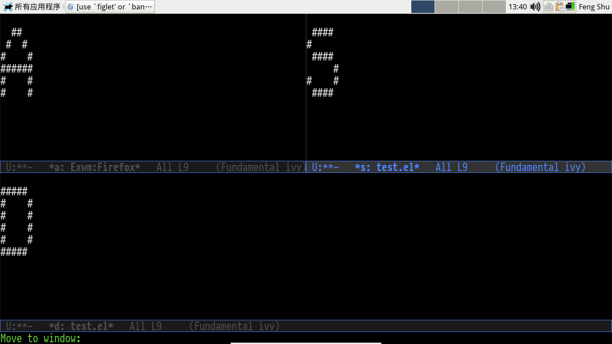

- [What is switch-window](#org3ff733c)
  - [Installation](#org2860532)
  - [Configure and Usage](#org3b488d2)
  - [Tips](#org601becb)
    - [I want to select a window with "a-z" instead of "1-9".](#org62be9e3)
    - [I want to let window to show bigger label.](#orgb5a7f25)
    - [I want to **hide** window label when window's number < 3](#org9d5a106)
    - [I want to select minibuffer with label "z".](#org83e1ddb)
    - [I use text terminal, but I want **bigger** label.](#org49ae905)
    - [Switch-window seem to conflict with Exwm, how to do?](#org8debe33)
    - [I want to make switch-window beautiful?](#org1546442)
    - [Have any other similar package exist?](#org26689e0)
  - [Changelog](#org27d543b)
    - [1.5.0 - 2017-04-29](#orgd49c298)
    - [1.0.0 - 2015-01-14](#orgd1c7fda)
    - [0.11 - 2013-09-14](#org6dc6733)
    - [0.10 - 2011-06-19](#orga966568)
    - [0.9 - 2010-11-11 - emacs22 called, it wants some support](#orgfe9f458)
    - [0.8 - 2010-09-13 - 999](#org626635d)
    - [0.7 - 2010-08-23 - window-dedicated-p](#orgd9a331a)
    - [0.6 - 2010-08-12 - **Minibuf-1**](#org7270469)
    - [0.5 - 2010-08-08 - Polishing](#orgacc05d5)

# What is switch-window

switch-window is an emacs window switch tool, which offer a **visual** way to choose a window to switch to, delete, split or other operations.

## Installation

1.  Config melpa source, please read: <http://melpa.org/#/getting-started>
2.  M-x package-install RET switch-window RET

Note: User can install switch-window with [El-Get](http://github.com/dimitri/el-get) too.

## Configure and Usage

    (require 'switch-window)
    (global-set-key (kbd "C-x o") 'switch-window)
    (global-set-key (kbd "C-x 1") 'switch-window-then-maximize)
    (global-set-key (kbd "C-x 2") 'switch-window-then-split-below)
    (global-set-key (kbd "C-x 3") 'switch-window-then-split-right)
    (global-set-key (kbd "C-x 0") 'switch-window-then-delete)

## Tips

### I want to select a window with "a-z" instead of "1-9".

    (setq switch-window-shortcut-style 'qwerty)
    (setq switch-window-qwerty-shortcuts
          '("a" "s" "d" "f" "j" "k" "l" ";" "w" "e" "i" "o"))

### I want to let window to show bigger label.

    (setq switch-window-increase 6) ;Increase or decrease this number.

### I want to **hide** window label when window's number < 3

    (setq switch-window-threshold 2)

### I want to select minibuffer with label "z".

    (setq switch-window-minibuffer-shortcut "z")

### I use text terminal, but I want **bigger** label.

The only choice is using asciiart, which **draw** a bigger label with **small** ascii char.

    (setq switch-window-asciiart-shortcut t)

### Switch-window seem to conflict with Exwm, how to do?

By default, switch-window get user's input with the help of function \`read-event', this approach does not work well with [Exwm](https://github.com/ch11ng/exwm) (Emacs X window manager), user should set the below variable and use minibuffer to get input instead:

    (setq switch-window-input-style 'minibuffer)

### I want to make switch-window beautiful?

All you should to do is setting the variable \`switch-window-label-buffer-function', for example:

    (setq switch-window-label-buffer-function
          'my-switch-window-label-buffer-function)

The below are some switch-window user's showcases:

### Have any other similar package exist?

-   [ace-window](https://github.com/abo-abo/ace-window)

## Changelog

### 1.5.0 - 2017-04-29

-   Implement commands:
    1.  switch-window-then-maximize
    2.  switch-window-then-delete
    3.  switch-window-then-split-below
    4.  switch-window-then-split-right
    5.  switch-window-then-split-horizontally
    6.  switch-window-then-split-vertically
    7.  switch-window-then-swap-buffer
-   Let switch-window work well with Exwm (Emacs X window manager).
-   User can customize switch-window label's appearance.

### 1.0.0 - 2015-01-14

-   Please fixme.

### 0.11 - 2013-09-14

-   restore point to end-of-buffer for windows where it was the case after switching, fixing an anoying bug.

### 0.10 - 2011-06-19

-   implement M-x delete-other-window (thanks developernotes on github)

### 0.9 - 2010-11-11 - emacs22 called, it wants some support

-   implement a propertize based hack to support emacs22

### 0.8 - 2010-09-13 - 999

-   Suport more than 9 windows (with a single key to type)
-   Use quail-keyboard-layout to choose single key labels for windows

### 0.7 - 2010-08-23 - window-dedicated-p

-   temporarily unset the window dedicated flag for displaying the numbers, patch from René Kyllingstad <Rene@Kyllingstad.com>
-   fix timeout and RET handling wrt to not changing window selection

### 0.6 - 2010-08-12 - **Minibuf-1**

-   add support for selecting the minibuffer when it's active
-   some try at a better horizontal centering
-   assorted cleanup

### 0.5 - 2010-08-08 - Polishing

-   dim:switch-window-increase is now a maximum value

Converted from switch-window.el by [el2org](https://github.com/tumashu/el2org) .